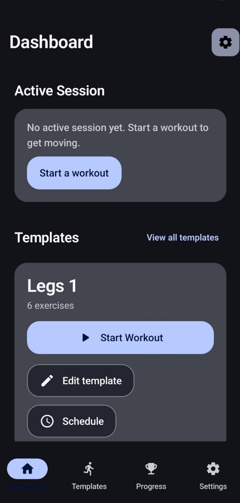
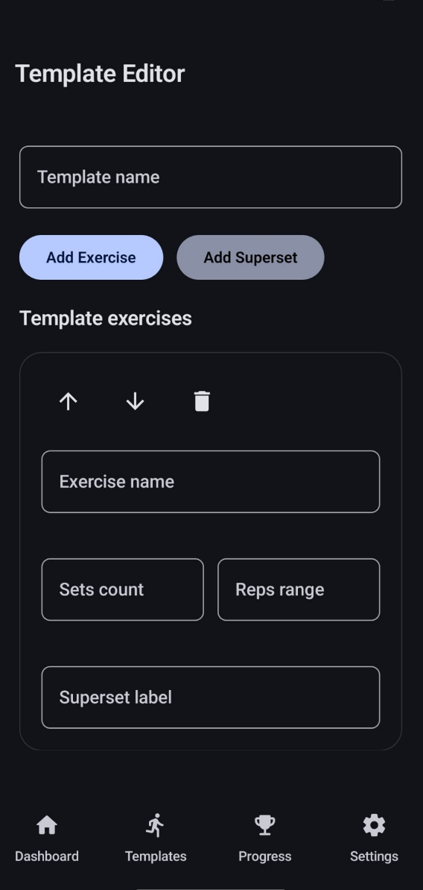
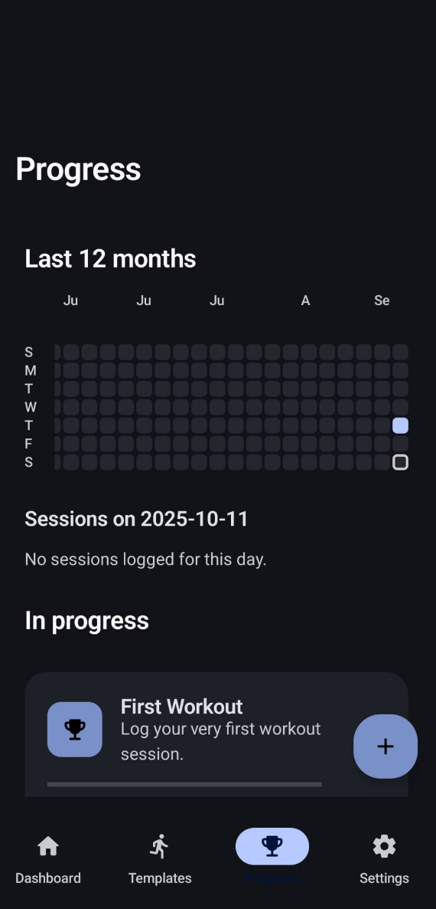
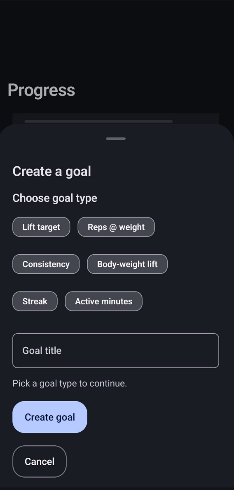

# Tetsu


  


<p align="left">
  </a>
  </a>
  </a>
  </a>
</p>


## Installation

Grab the `.apk` file from the latest official release

Or clone and build the latest version from source

```bash
# Clone the repository
$ git clone https://github.com/your-org/tetsu.git
$ cd tetsu

# Build the debug APK
$ ./gradlew assembleDebug
```

After the build finishes, the generated APK can be found in `app/build/outputs/apk/debug/` (e.g. `app/build/outputs/apk/debug/app-debug.apk`).
